# TaichiArduboy

[toc]

基于Arduboy框架的游戏机项目。完全兼容Arduboy，紧凑硬件设计，实测续航约28h。

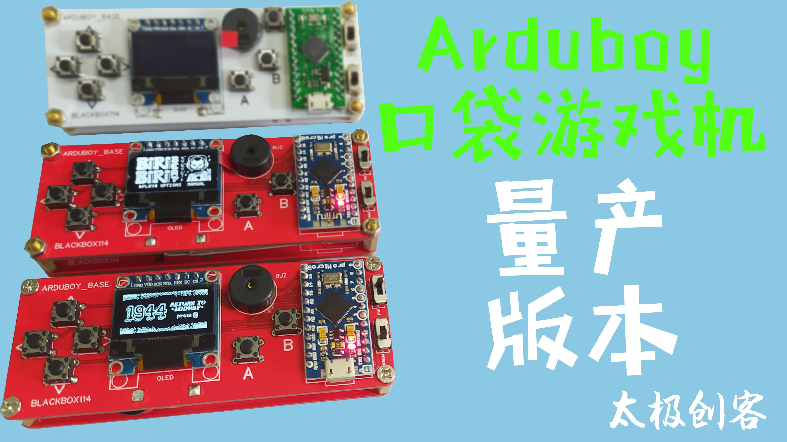 

### 总览

 TaichiArduboy是一个Arduboy框架的开源硬件设计。设计需要焊接，为方便DIY，全部元件采用直插，并选择最常见的方便采购的元件。口袋游戏机兼容所有arduboy游戏，您也可以编写自己的游戏上传。设置了开关控制蜂鸣器通断，板上也设置了锂电池充放一体模块，可插接JST头转接软包锂电池。

### 材料清单
|         材料          | 数量 |
| :-------------------: | :--: |
| ArduinoPromicro开发板 |  1   |
|  0.96寸SPI 7针OLED屏  |  1   |
|       按键开关        |  7   |
|        拨动开关         |  2   |
| TP4056锂电池充放模块  |  1   |
|      无源蜂鸣器       |  1   |
|       PCB电路板       |  1   |
|         JST头         |  1   |
|      3.7v锂电池       |  1   |
|      M3六角铜柱       |  4   |
|        面包板         |  4   |
|        M3螺母         |  4   |

注：主控请一定使用ArduinoPromicro或兼容同型号开发板,本例程内请勿使用其他型号代替。如果有多的电路板，可以用六角铜柱和螺丝把两块电路板连在一起，做成半封闭外壳，更易携带。

 

### 接线图

如果没有PCB电路板，或者不方便焊接，您可以用面包板搭建一个最简单的小掌机，遵照以下电路图即可。这个电路没有复位和电池模块，需要持续供电才能运行。

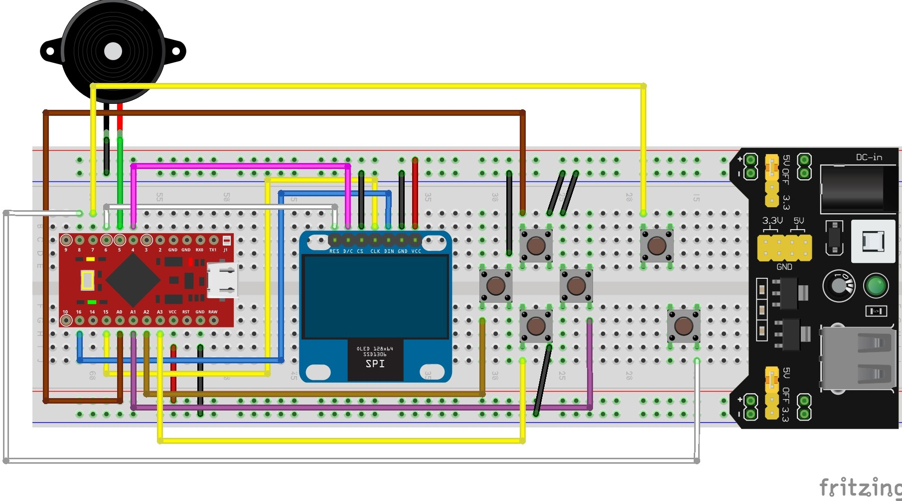 

### 获取电路板
电路板制作文件位于 /电路板加工文件 文件夹下。gerber文件请直接在PCB板厂计价入口提交.zip压缩包送厂制版（该文件在某厂商估价5元包邮），或在太极创客淘宝店采购游戏机散件进行焊接。

如果您想修改电路板文件，或制作自己的电路板印花，请访问[此处](https://oshwhub.com/blackbox114/arduboy-di-zuo)获取PCB板源文件。

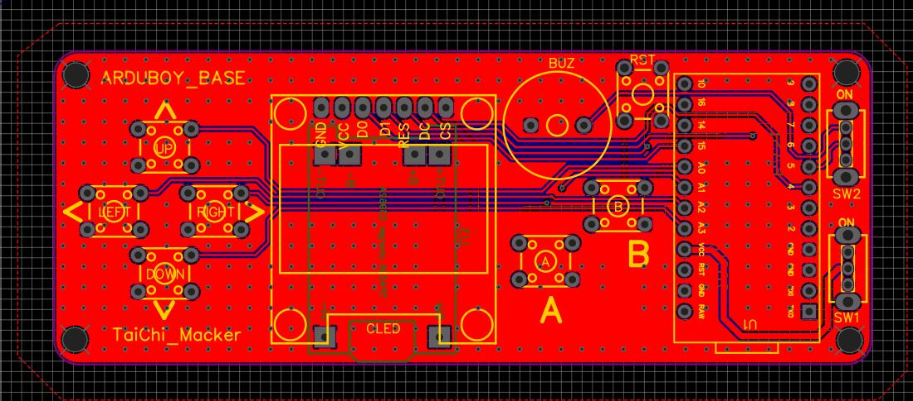 

### 搭建说明

#### step1

确认元件是否买齐，插上电路板确定封装是否正确

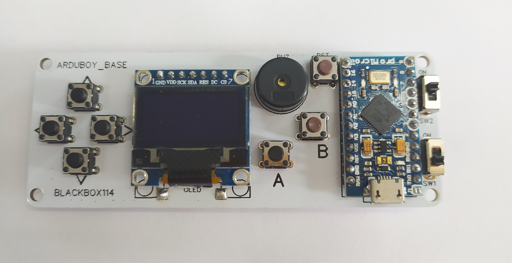 

#### step2

进行焊接。焊接顺序为电源模块→屏幕→按键→ArduinoPromicro→蜂鸣器→蜂鸣器开关和电源开关

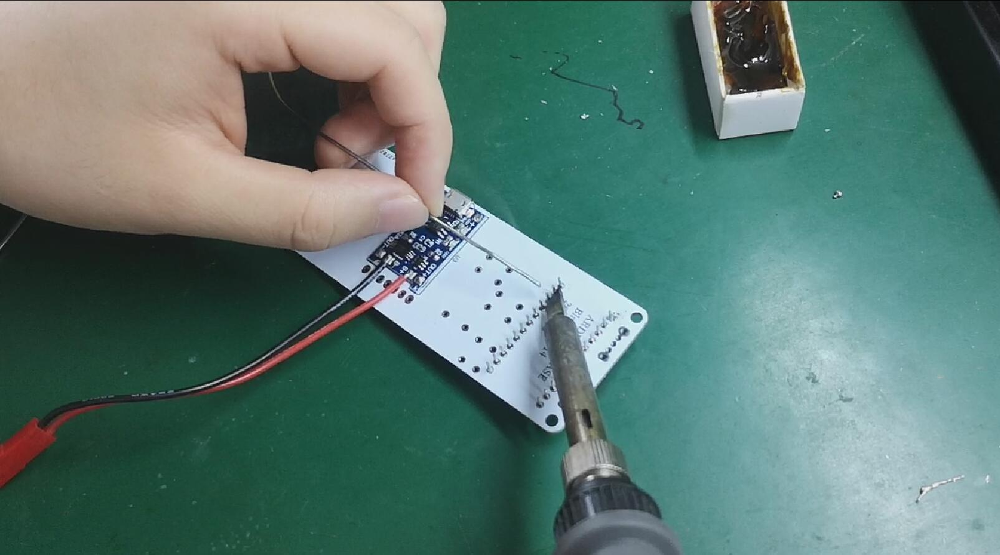 

#### step3

焊接完成后用数据线将TaichiArduboy连接上电脑

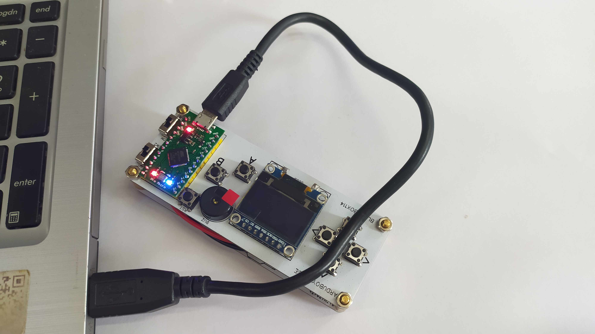 

#### step4

游戏上传一般有两种方式。

- 方式一：如果您有arduboy游戏的十六进制文件，您可以直接安装 /上传游戏 文件夹中的ArduboyUploader_setup.exe ，并打开游戏十六进制文件，选择游戏文件后烧录。烧录时如果没有反应，请按下游戏机上的RST键进行复位。本仓库 /上传游戏/不带源码的游戏 中有五个arduboy游戏的十六进制文件可供下载。

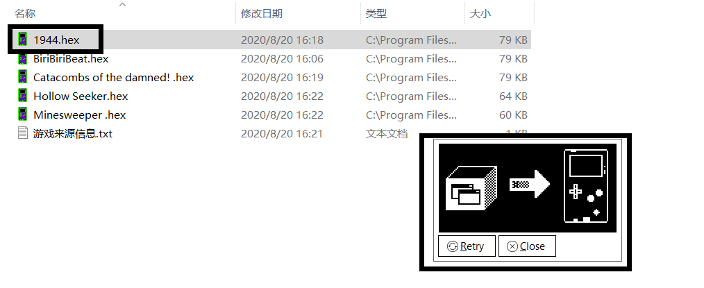 

- 方式二：如果您有arduboy游戏的源文件，请用arduinoIDE打开游戏的主程序（文件夹内的.ino文件）

  请添加以下依赖库：

  打开库管理器 

  
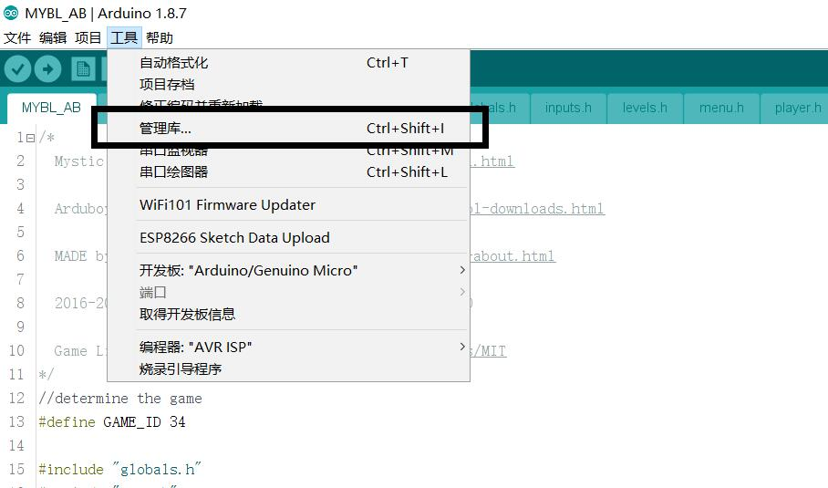 

  添加这两个依赖库 

  
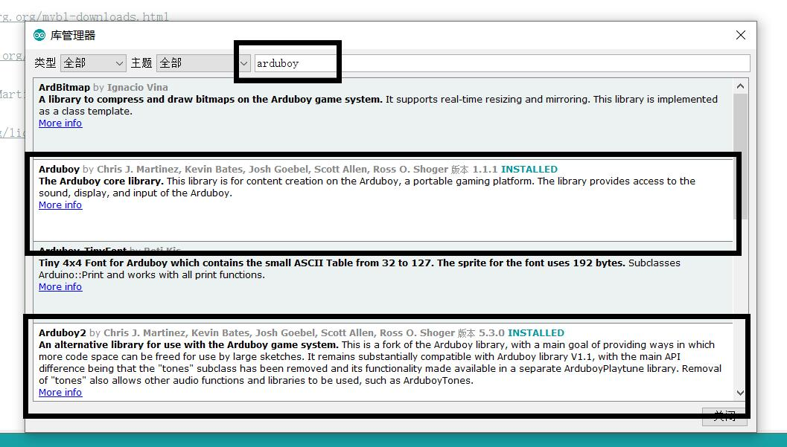 

  

  完成库文件添加后链接游戏机后选择Arduino/Genuino Micro开发板和相应的串口上传游戏。本仓库 /上传游戏/带源码的游戏 中有五个arduboy游戏的源码工程文件可供下载。

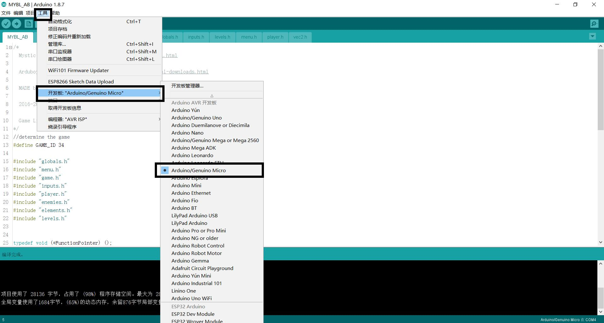 

如果对arduinoIDE的使用有疑问，请访问此处获取[太极创客零基础入门学用 Arduino 教程](http://www.taichi-maker.com/homepage/arduino-basic-tutorial-index/#intro)。

如果您对添加第三方库有疑问，请访问此处获取[为Arduino IDE安装添加库教程](http://www.taichi-maker.com/homepage/reference-index/arduino-library-index/install-arduino-library/)。

### 量产展示

搭建好小游戏机后，可以下载任何兼容arduboy的游戏。一些网站上托管了不少游戏，可以前往[此处](https://arduboy.ried.cl/)下载

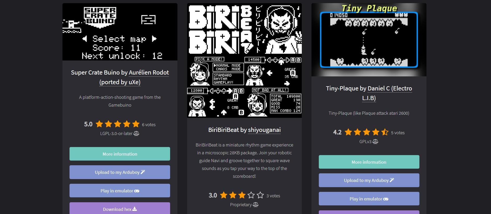 

TaichiArduboy口袋游戏机展示

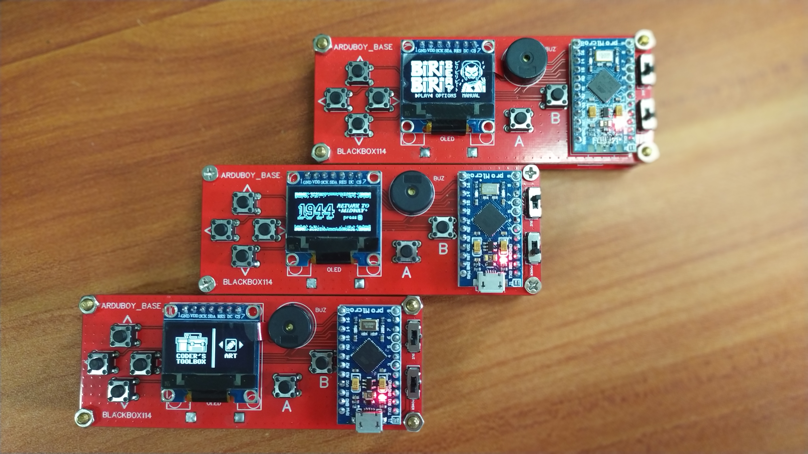 

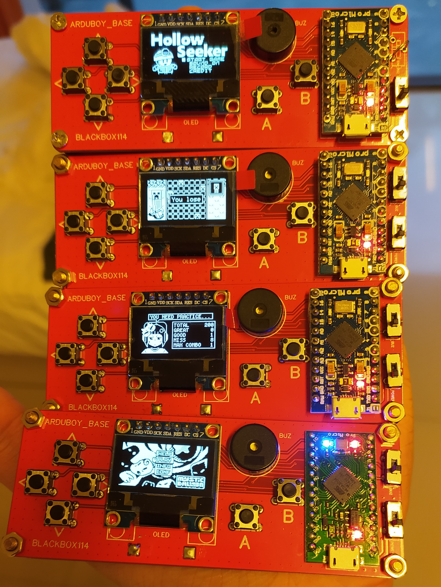 

### 更多信息

这个小制作展示了简单的PCB的设计，需要用到简单的焊接技巧。每次只能下载游玩一个游戏，未来可以扩展外置flash储存更多游戏。如果您想学习更多arduino或物联网开发相关知识，请访问[太极创客官网](http://www.taichi-maker.com/)获取更多教程。

